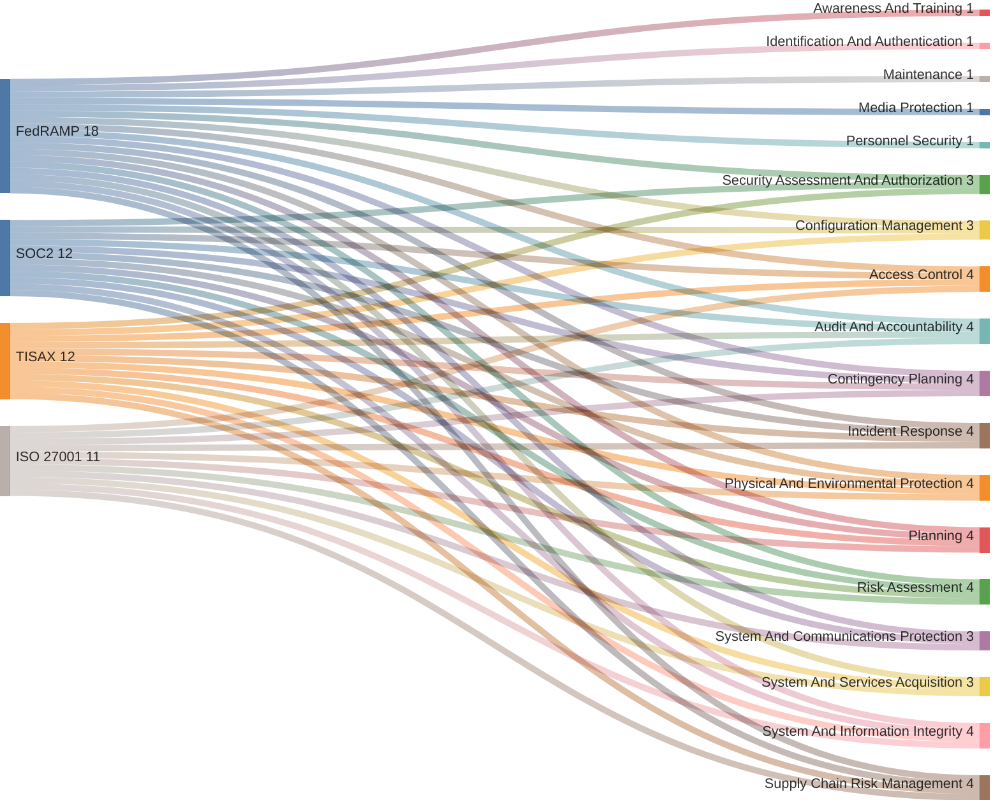

# Security Compliance Policies

[
Access Control](/policies/ac.md)
 
[
Awareness and Training](/policies/at.md)
 
[
Audit and Accountability](/policies/au.md)
 
[
Security Assessment and Authorization](/policies/ca.md)
 
[
Configuration Management](/policies/cm.md)
 
[
Contingency Planning](/policies/cp.md)
 
[
Identification and Authentication](/policies/ia.md)
 
[
Incident Response](/policies/ir.md)
 
[
Maintenance](/policies/ma.md)
 
[
Media Protection](/policies/mp.md)
 
[
Physical and Environmental Protection](/policies/pe.md)
 
[
Planning](/policies/pl.md)
 
[
Personnel Security](/policies/ps.md)
 
[
Risk Assessment](/policies/ra.md)
 
[
System and Services Acquisition](/policies/sa.md)
 
[
System and Communications Protection](/policies/sc.md)
 
[
System and Information Integrity](/policies/si.md)
 
[
Supply Chain Risk Management](/policies/sr.md)
 
