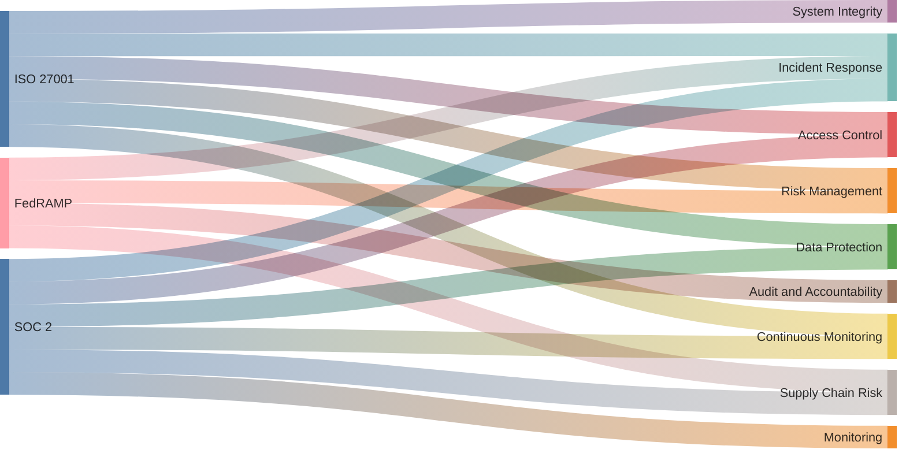

# Security Compliance Policies

[
Access Control](/gov/ac.md)
 
[
Awareness and Training](/gov/at.md)
 
[
Audit and Accountability](/gov/au.md)
 
[
Security Assessment and Authorization](/gov/ca.md)
 
[
Configuration Management](/gov/cm.md)
 
[
Contingency Planning](/gov/cp.md)
 
[
Identification and Authentication](/gov/ia.md)
 
[
Incident Response](/gov/ir.md)
 
[
Maintenance](/gov/ma.md)
 
[
Media Protection](/gov/mp.md)
 
[
Physical and Environmental Protection](/gov/pe.md)
 
[
Planning](/gov/pl.md)
 
[
Personnel Security](/gov/ps.md)
 
[
Risk Assessment](/gov/ra.md)
 
[
System and Services Acquisition](/gov/sa.md)
 
[
System and Communications Protection](/gov/sc.md)
 
[
System and Information Integrity](/gov/si.md)
 
[
Supply Chain Risk Management](/gov/sr.md)
 
