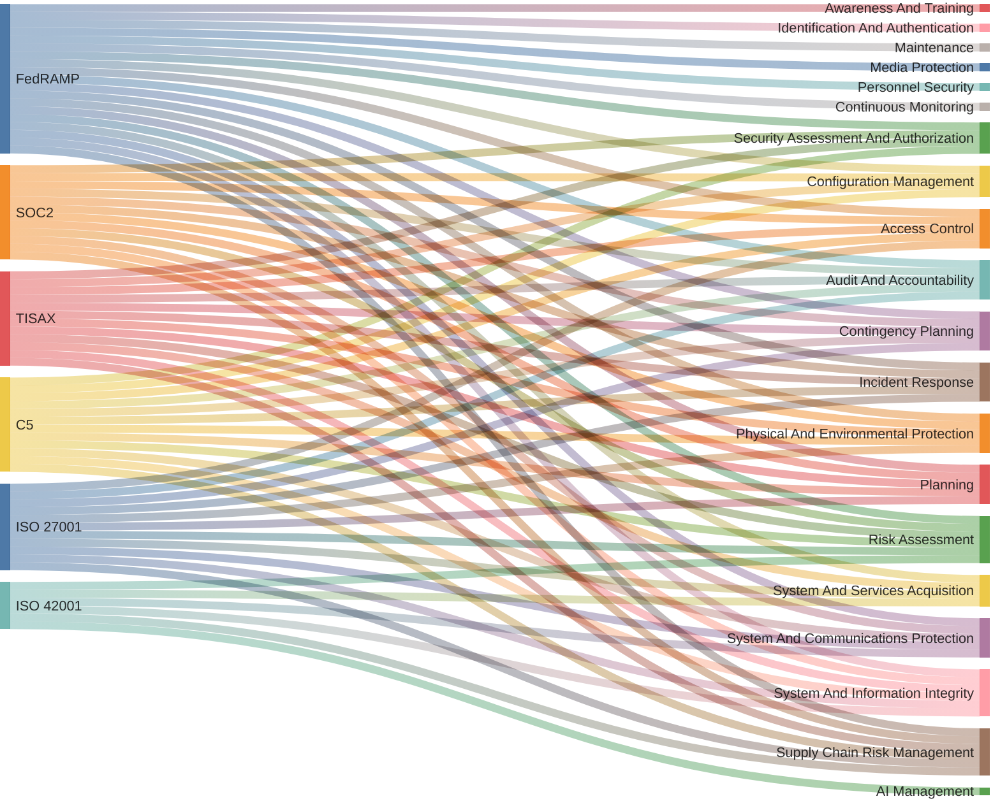

[![GitHub last commit][commitbadge]][commits]
[][commits]
[][commits]

<!--bodytext-->
### Access Control Mechanisms

* User Identification and Authentication: Describe mechanisms for user identification and authentication, including password policies and multi-factor authentication (MFA).
* Access Approval: Outline the process for granting, modifying, and revoking access, including the approval workflow.
* Access Reviews and Audits: Define the process for regular reviews and audits of access controls and user permissions.
  
### Access Control Policies and Procedures

* Access Control Policies: Detail specific access control policies, including least privilege, separation of duties, and access control lists.
* Procedures for Access Requests: Describe the procedures for requesting and approving access, including forms and approvals needed.
* Procedures for Access Termination: Outline procedures for terminating access when employees leave or change roles.
  
### Access Control Controls

* Physical and Logical Access Controls: Describe physical and logical controls used to restrict access to systems and data.
* System Access Controls: Specify controls for system access, including role-based access control (RBAC) and attribute-based access control (ABAC).
* Remote Access Controls: Define policies and procedures for remote access, including VPNs and remote desktop protocols.

*** 

<!--ref links -->
[commitbadge]: https://img.shields.io/github/last-commit/jluufigma/grc-docs?path=gov%2Fac.md&logo=figma&logoColor=white&label=last%20updated&color=darkgreen
[commits]: https://github.com/jluufigma/grc-docs/commits/main/gov/ac.md
